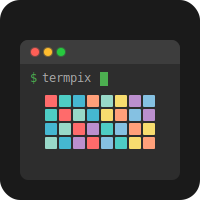

# Termpix - Modern Terminal Image Display

 [](https://badge.fury.io/rb/termpix)  



Display images in the terminal using the best available protocol.

## Features

- Auto-detects terminal capabilities
- Supports multiple protocols:
  - Kitty Graphics Protocol (Kitty, WezTerm, Ghostty)
  - Sixel (xterm, mlterm, foot, konsole, iTerm2)
  - Überzug++ (modern X11/Wayland)
  - w3mimgdisplay (legacy fallback)
- Clean, simple API
- Graceful fallbacks

## Installation

```bash
gem install termpix
```

Or add to your Gemfile:

```ruby
gem 'termpix'
```

## Usage

```ruby
require 'termpix'

# Create display instance (auto-detects best protocol)
display = Termpix::Display.new

# Show an image
display.show('path/to/image.png',
  x: 10,           # X position in terminal characters
  y: 5,            # Y position in terminal characters
  max_width: 80,   # Maximum width in characters
  max_height: 40)  # Maximum height in characters

# Clear the image
display.clear

# Check if images are supported
puts "Supported!" if display.supported?

# Get protocol info
info = display.info
puts "Using protocol: #{info[:protocol]}"
```

## Force a Specific Protocol

```ruby
# Force Kitty protocol
display = Termpix::Display.new(protocol: :kitty)

# Force Sixel
display = Termpix::Display.new(protocol: :sixel)

# Force w3m
display = Termpix::Display.new(protocol: :w3m)
```

## Dependencies

- ImageMagick (`identify` and/or `convert` commands)
- For w3m/Überzug++: `xwininfo` and `xdotool`

## Terminal Support

### Kitty Protocol
- Kitty
- WezTerm
- Ghostty
- Konsole (partial)

### Sixel
- xterm (with `-ti vt340`)
- mlterm
- foot
- WezTerm
- iTerm2

### w3m/Überzug++
- Most X11 terminals
- Wayland terminals (Überzug++ only)

## License

Unlicense - Public Domain

## Author

Geir Isene - https://isene.com
